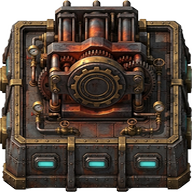
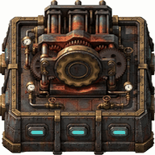
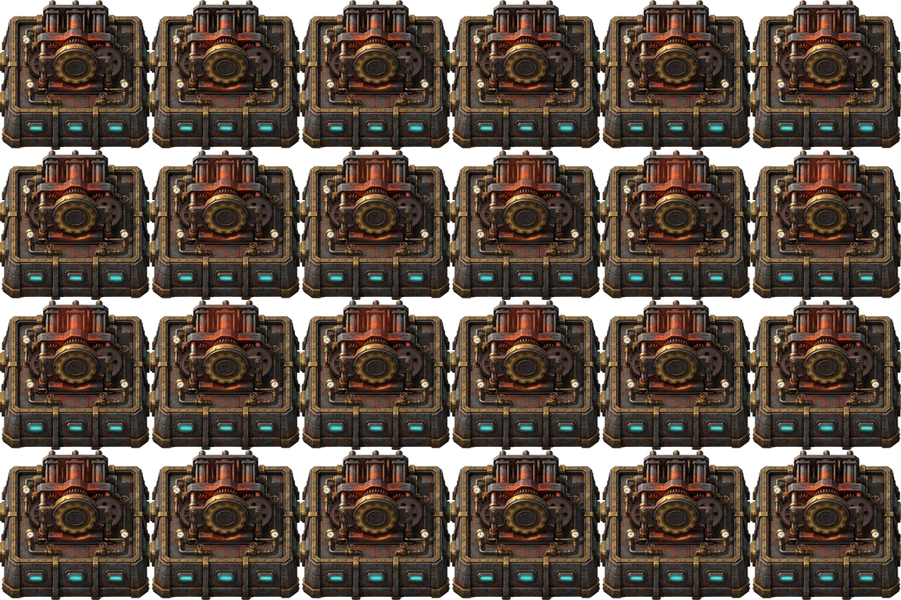

# Animatorio

Animatorio turns a static image into an animated sprite sheet.

It is primarily intended for **Factorio modders** who want to add motion to an existing building, machine, or other sprite without redrawing every frame by hand. You describe the moving parts in JSON, preview them in the web editor, and export a configurable sprite sheet for use in your mod.

The built-in motions are deliberately very Factorio-oriented: mechanical rotors, gears, gauges, indicator lights, steam, and similar machine details. Animatorio is not limited to Factorio, though. It can be useful anywhere that needs sprite-sheet generation, provided the available motion types fit the image and the target pipeline.

## What it does

Animatorio applies only the localized motions declared in an asset definition. This makes it possible to animate a rotor behind a grille, jiggle a component inside a housing, or add a moving highlight without altering the rest of the sprite.
| Static source image | Generated animation |
|---|---|
|  |  |




The default output is a 6×4 sheet containing 24 frames. The frame count can be changed per asset in the web editor, but prime counts are rejected so the sheet can use a derived rectangular layout. Loops are designed to close cleanly: mechanical parts advance by an integer number of pitches per loop, and vibration profiles use periodic harmonics.

## Quick start

### 1. Install the dependencies

Python 3.9 or newer is recommended.

```bash
pip install -r requirements.txt
```

### 2. Start the web editor

```bash
python3 webui/server.py
```

Then open <http://127.0.0.1:8765/>. You can optionally choose a port, suppress automatic browser opening, or open an asset directly:

```bash
python3 webui/server.py --port 8765 --no-browser --open animations/my-sprite.json
```

The editor previews the same server-side handlers used during generation, so the preview and the baked sheet use the same pipeline. Open an existing JSON asset or create one from an image, add and position motion layers, then save or export a GIF preview.

The workspace is organized around the editing loop: the layer stack is on the left, the live canvas is in the center, and properties for the selected motion are on the right. Save, GIF export, and sheet generation remain available in the header. Direct JSON editing is still available under **Advanced JSON** when a motion needs a field that does not yet have a visual control.

Lighting is configured per asset under the **Asset** inspector. The default light is 35° from screen-left toward the top-left, with adjustable directional strength and ambient fill. Material-producing layers (cogs, rotors, edge-on gears, and gauges) follow that light by default. A layer can instead set `lighting.mode` to `custom` and provide its own `direction_degrees`, `strength`, and `ambient` values.

### 3. Generate sprite sheets

```bash
python3 generate_animations.py
```

This reads every asset in `animations/*.json`, writes the configured output sheets, and updates `generated-metadata.json` with generation and loop-seam metrics. To generate selected assets:

```bash
python3 generate_animations.py --asset my-sprite --asset another-sprite
```

If the images and JSON files live in another checkout, set `ANIMATORIO_ASSET_ROOT` (or `ANIMATORIO_ROOT`):

```bash
export ANIMATORIO_ASSET_ROOT=/path/to/your/assets
```

## Motion types

### Mechanical motions

- **`mechanical_rotor`** — a perspective-projected fan or rotor with a fixed hub and housing.
- **`mechanical_gear`** — a rotating toothed face with open, solid, spoke, or holed fills, optional thickness, and source-art center restoration.
- **`vertical_gear`** — an edge-on wheel moving through a four-point perspective polygon.
- **`gauge`** — a perspective-projected dial and needle, with optional face, rim, ticks, shadow, and pivot cap.
- **`vibration`** — masked component jiggle with sine, motor, or rattle profiles, subpixel translation, and optional micro-rotation.

### Effects and overlays

- **`source_occluder`** — restores source pixels above earlier layers, useful for putting a moving cog behind a housing bar. Supports polygons and ellipse rings.
- **`surface_scan`** — a highlight or print line travelling across a perspective surface.
- **`sweep`** and **`orbit_glint`** — radial light sweeps or orbiting reflections clipped to polygons.
- **`signal`**, **`pulse`**, and **`chase`** — antenna arcs, synchronized status lights, and sequential LED patterns.
- **`steam`** — restrained steam or glow clipped to a local surface mask.

Most editor controls are exposed visually: perspective handles, centers, pivots, amplitude vectors, custom polygon vertices, layer ordering, and per-layer parameters. The raw JSON panel is available when an option needs to be edited directly.

## Preview and diagnostic tools

These scripts do not require a Factorio installation:

| Command | Purpose |
| --- | --- |
| `python3 make_gif_previews.py` | Create per-asset GIFs and an animated gallery in `output/gifs/`. |
| `python3 make_mechanical_motion_gallery.py` | Create a close-up gallery of mechanical motion. Edit the script’s `ASSETS` list to choose sprites. |
| `python3 make_gear_registration_diagnostics.py` | Review gear crops, basis overlays, phase strips, GIFs, and loop-seam metrics. |
| `python3 make_vertical_gear_diagnostics.py` | Review vertical-gear polygons, perspective overlays, cosine speed profiles, and GIFs. |
| `python3 make_vibration_diagnostics.py` | Review vibration masks, pivots, amplitude vectors, phase strips, and loop closure. |
| `python3 fit_rotor_registration.py` | Suggest rotor registration fits from luminance transitions. Always verify the result visually. |

## Optional Factorio validation

The `validation_mod/` directory and the related validation scripts provide example hooks for checking generated assets in the Factorio engine. They are optional and are not required to use Animatorio as a standalone sprite-sheet generator.

Before running engine validation, edit [`validation-config.ini`](validation-config.ini) for your local installation:

```ini
[path]
read-data=/Applications/Factorio.app/Contents/data
write-data=/tmp/animatorio-validation-data

[general]
locale=en
```

- `read-data` must point to the Factorio `data` directory that the validation run should load.
- `write-data` is an isolated, writable directory where Factorio can place its validation save, script output, and screenshots. Change it if `/tmp` is not suitable on your system.
- `locale` selects the Factorio locale used during validation.

The sample file uses a placeholder game path, so replace `read-data` with the path to your Factorio installation before running validation. Keep `write-data` separate from the game or mod checkout so generated validation files do not mix with source assets.
